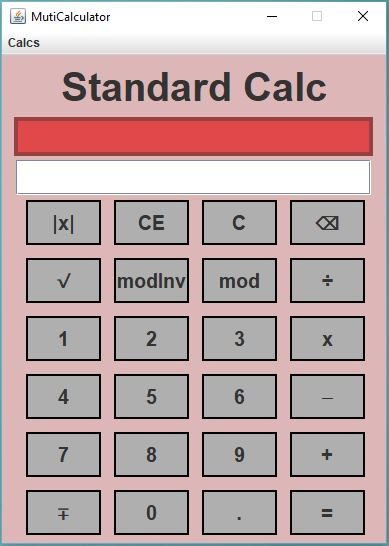
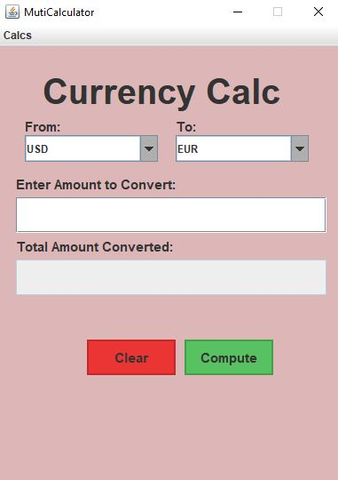
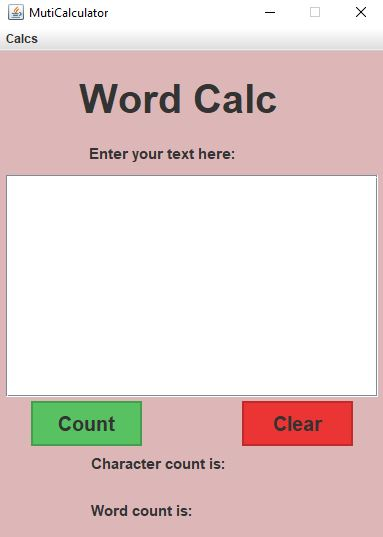

# MultiCalc

This multi-purpose calculator cotains 4 different types of calulators.The default calulator is **StandarCalc**. By clicking on the **calcs** menu you can access the four types of calulators. 

The standard calculator looks like this:

The grade calculator looks like this:

The currency calculator looks like this:

The word counter calculator look like this:

